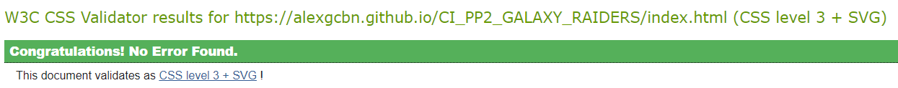
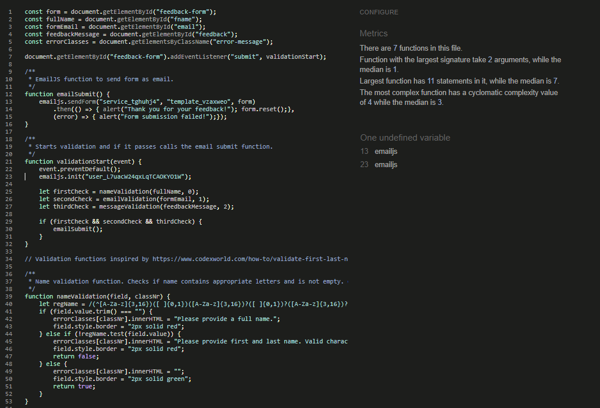

# Galaxy Raiders
In order to view the live site, click [here](https://alexgcbn.github.io/CI_PP2_GALAXY_RAIDERS/index.html).

Galaxy Raiders is a personal remake of the classic game "Space invaders". The intent of the project is to provide users with a representation of the game, along with some information about the game and the person who developed the page. It was intended to keep the game as close to the original as possible in terms of gameplay, yet there might be some key differences. Even so, the website strives to provide the user with a pleasant and fun way to pass time and maybe relive some childhood memories.

## Table of contents:

1. [User Stories](#user-stories)
2. [Goals](#goals)
3. [Features](#features)
4. [Design](#design)
    1. [Colours](#colours)
    2. [Fonts](#fonts)
    3. [Structure](#structure)
    4. [Wireframes](#wireframes)
5. [Technologies used](#technologies-used)
6. [Testing](#testing)
    1. [Validation](#validation)
    2. [Device and browser testing](#device-and-browser-testing)
    3. [User stories testing](#user-stories-testing)
7. [Bugs](#bugs)
8. [Deployment](#deployment)
9. [Credits](#credits)

## User Stories:

### As a first time user, I want to:
1. Understand how to play the game.
2. Have easy to use controls for the game.
3. Learn more about the game's origins.
4. Play the game!

### As a recurring user, I want to:
5. Be able to provide feedback.
6. See my score, so I can compare it to previous runs.
7. See how to get in touch with the creator.
8. Be able to navigate the website easily.

### As the website owner, I want to:
9. Be able to receive feedback emails.
10. Provide information about myself and how to contact me.

## Goals:
### Development goals:
* Have a fully responsive and accessible website.
* Provide a consistent experience throughout the pages.
* Provide easy navigation.
* Have a design that fits the game.
* Develop the website with as much interactiveness as possible.
* Be able to get feedback that has passed through validation.

### Target audience goals:
* Provide a theme that fits the era and game style.
* Have more than one ways for people to contact the owner.
* Have easy to use and understand navigation.
* Provide feedback to each user.

## Features:

### Pages:
We have a total of 3 pages, along with a 404 page. They include the below features.

### Navbar:

* Provides easy to use navigation across all pages.
* Is static on screen, to reduce scrolling.
* Provides visual cues on hover and for active page.
* Is responsive and becomes smaller on mobile screens.

#### User stories covered: 8

### Scoreboard:

* Provides game score, which is updated live.
* Provides visual cue every time the score increases with animation.
* Resets every time the game starts.

#### User stories covered: 6

### Game Area:

* Main game area, where the game is displayed.
* Is responsive and becomes as small as possible for mobile devices.
* Style matches rest of the page.

#### User stories covered: 4

### Game buttons:

* They provide functionality to the game.
* They are responsive and are on the bottom to fit a horizontal mobile position.
* They provide visual cues on click.

#### User stories covered: 2

### Footer:

* Provides the name of the creator and social media links.
* Provides a link to jump to top of page.
* Also provides a link to the contact page, to send a message.
* Text disappears on small screens.

#### User stories covered: 8, 10

### About game:

* Provides information on the original game and why this one exists.
* Provides statement about non-affiliation.

#### User stories covered: 3

### Game instructions:

* Provides information on how to play the game.
* Has both mobile and keyboard controls.
* Explains what happens when the board is cleared.

#### User stories covered: 1

### Feedback form:

* Form that requests basic user information.
* Sends them to my email through EmailJS.
* Validates all fields and provides visual feedback if they are not completed correctly.

#### User stories covered: 5, 9

### About me:

* Basic information about creator.
* Basic information about relation to project.
* Provides links to creator's GitHub and LinkedIn.

#### User stories covered: 7, 10

## Design:

The website was designed with the word "retro" in mind. 
The artwork is pixelated and even the fonts try to keep the oldschool arcade games style.
Even though the design is mostly simple, functionality was the priority here.

### Colours & background:
The colours and the page's background were mostly created by the [Pixel Space Background Generator](https://deep-fold.itch.io/space-background-generator). All credits go to the creator of the tool.

The rest of the page's colours were drawn from the image the tool created.

### Artwork:
The artwork for the spaceship and aliens was taken from [this kit here.](https://bizmasterstudios.itch.io/spaceship-creation-kit)
All credits go to the creator of the kit.

### Fonts:
[Anton](https://fonts.google.com/specimen/Anton?query=anton) was used for the page's logo, as it is simple yet fits the space style.

[Space Mono](https://fonts.google.com/specimen/Space+Mono?query=space+mono) was chosen because it looks like a retro "computer" font.

### Structure: 
The website's structure is simple, with a main page and two additional. 
We have a navbar on the top of the page that is fixed, to eliminate scrolling up. Most users are used to this layout from most pages online. 
The logo is also the main page's link. The other two pages are "About" and "Contact". The content of the pages is self explanatory.
The user can always understand which page they are on by the red "aura" on the page name. A smaller red aura appears on hover.
* GALAXY RAIDERS (Home): The game area is decorated with a scoreboard on top and the game buttons on the bottom.
* About: Two sections here. The first has information about the game with a bit of a backstory. The second contains the instructions.
* Contact: Two more sections. First, we have a feedback form. It validates the data and, if successfully validated, sends an email. The second section contains some very basic information about the creator and links to GitHub and LinkedIn.

The website also contains a footer that has the same social links, along with a link to the feedback form and a "back to top" button.

### Wireframes:

Home page

About page

Contact page

## Technologies used:

### Languages
  * HTML
  * CSS
  * JavaScript

### Frameworks and tools
  * GitHub
  * VSCode
  * Balsamiq
  * EmailJS
  * Adobe Illustrator
  * Google Fonts
  * Favicon.io
  * Font Awesome
  * [Pixel Space Background Generator](https://deep-fold.itch.io/space-background-generator)

## Testing:
### Validation

 HTML 

The W3C Markup Validation Service was used to validate HTML code. All pages passed with no errors. The only warnings are related to the EmailJS script, which should be used as is.

### Home:

### About:

### Contact:

 CSS 

The W3C CSS Validation Service (Jigsaw) was used to validate CSS code.   
Both the URI and the direct code input pass with no errors. Some warnings that appear are either related to FontAwesome, or the "-webkit-" command that I have added for iOS devices.

### URI validation:

### Code validation:

 JavaScript 

JavaScript was tested on JSHint.com. ES6 was enabled in Configuration.
Both files pass with no errors. There is an undefined variable for the email file, yet that is related to EmailJS.

### game.js:

### email.js:

 Performance 

Website performance was tested with Google Developer Tools Lighthouse.   
All pages passed the tests with perfect results.

### Home:

### About:

### Contact:

 Accessibility 

Website accessibility was tested with the WAVE Web Accessibility Evaluation Tool.  
All pages passed with no errors. 

### Home:

### About:

### Contact:

### Device and browser testing

The website was tested on the following devices:
* Windows desktop PC (various components) running Windows 10
  * Chrome Version 92.0.4515.159
  * Edge Version 92.0.902.78
* iPhone 12 Pro
  * Safari 
* Various devices from users who tested for feedback

The webpage works great on all devices and browsers that it was tested on.  
Functionality between desktop and mobile remains the same, with the look of the page changing slightly.  
As the website was designed mobile-first, it fits mobile browsers perfectly while also changing to fit a larger screen and occupy more space.

### User stories testing:

1. USER STORY

| **Feature** | **Action** | **Expected Result** | **Actual Result** |
|-------------|------------|---------------------|-------------------|
| FEATURE | ACTION | EXPECTED RESULT | Works as expected |

Screenshots

## Bugs

1. BUG DESCRIPTION
   * BUG FIX DESCRIPTION

## Deployment:
* The site was deployed to GitHub pages. The steps to deploy are as follows: 
  * In the GitHub repository, navigate to the Settings tab 
  * From the source section drop-down menu, select the Master Branch
  * Once the master branch has been selected, the page will be automatically refreshed with a detailed ribbon display to indicate the successful deployment. 

The live link can be found here - LINK

## Credits:

* ADD CREDITS HERE